# Screen atlas

These are original publisher guide images, preserved without crop, resampling, or recoloring. Large outlined captions, arrows, dimming, and glow are publisher annotations. CDN dates identify media paths, not exact client builds.

## E01 — Café overview / edge toolbar

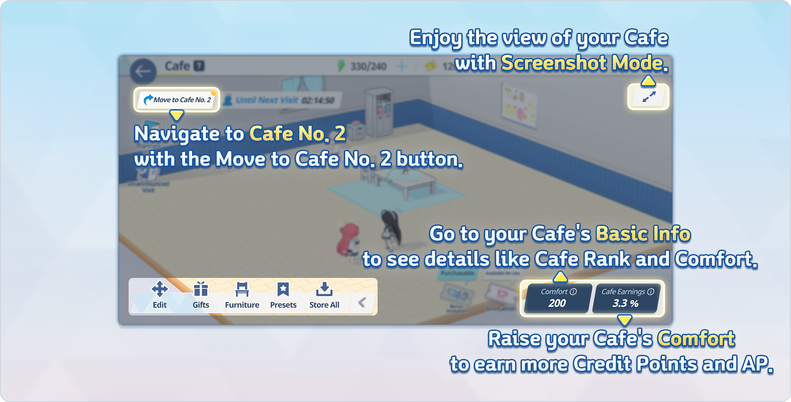

Whole composite; room, top bar, bottom tool strip and statistics. 1808 × 920 px. [Original file](https://dszw1qtcnsa5e.cloudfront.net/community/20260120/ec79307a-1418-4b44-8119-c52dc81d3335/InformatiofCafe01en.png); source S01.

## E02 — Furniture edit and install cards

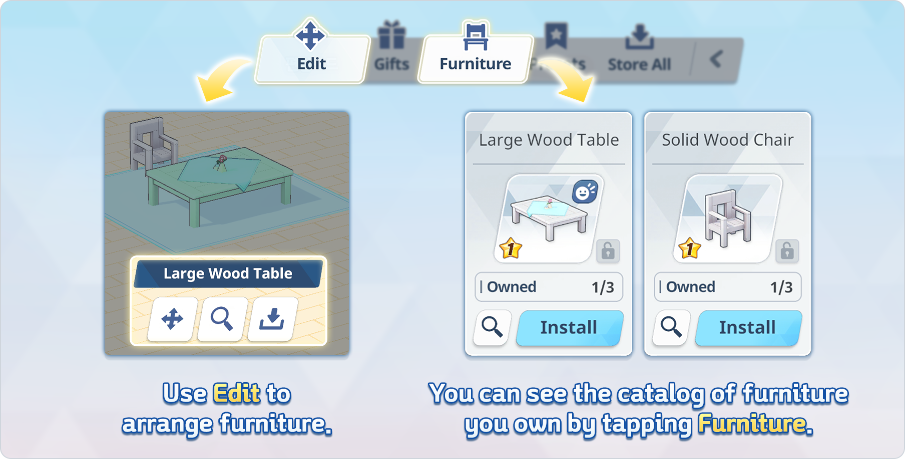

Left furniture selection and local toolbar; right inventory cards. 1808 × 920 px. [Original file](https://dszw1qtcnsa5e.cloudfront.net/community/20260915/f235c676-aa7d-4628-9f12-19ceba3f6c28/InformatiofCafe02En.png); source S01.

## E03 — Gift drag/drop and halo reaction

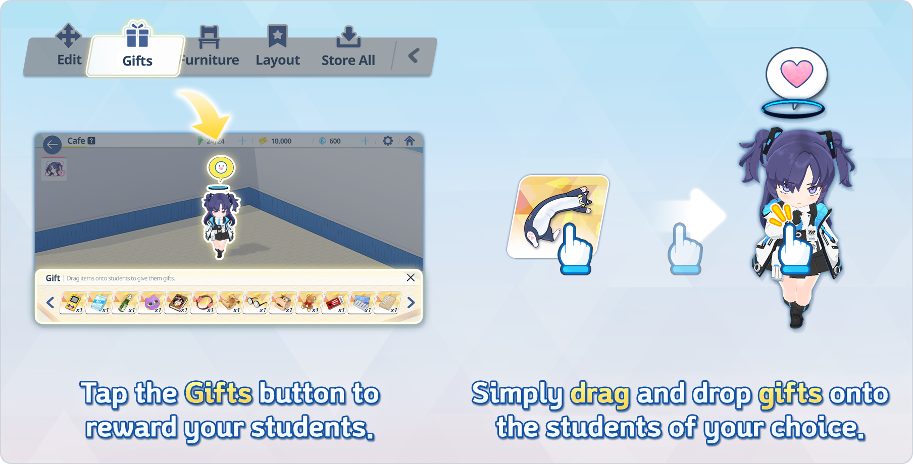

Left gift tray; right enlarged Yuuka, halo and reaction. 1808 × 920 px. [Original file](https://dszw1qtcnsa5e.cloudfront.net/community/20250624/13d863a6-fd9e-419c-b268-73a903371155/InformatiofCafe03En.png); source S01.

## E04 — Comfort and rank panels

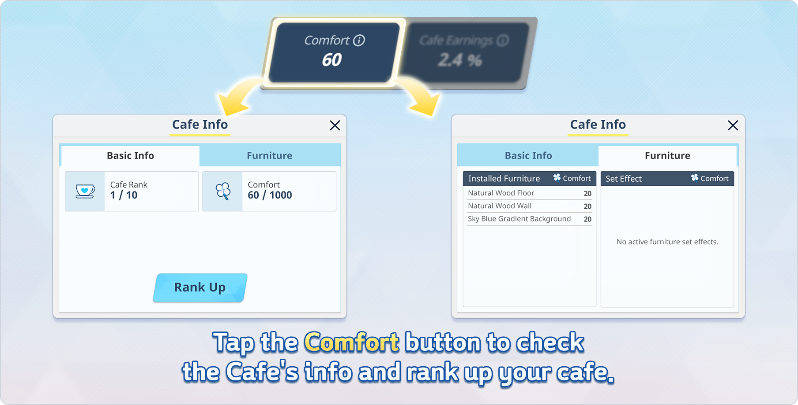

Basic Info and Furniture tables. 1808 × 920 px. [Original file](https://dszw1qtcnsa5e.cloudfront.net/community/20250624/6fdeaab8-69e7-45c2-8163-e0ec45db513d/InformatiofCafe04En.png); source S01.

## E05 — Earnings claim panel

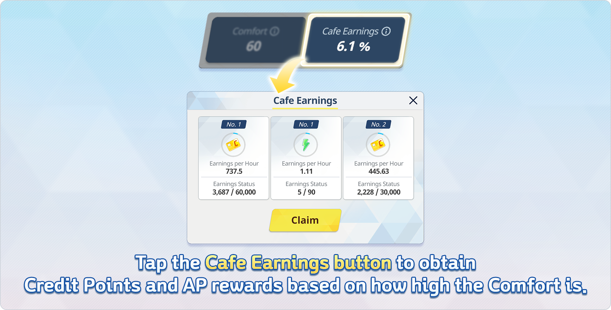

Three resource columns; yellow Claim action. 1808 × 920 px. [Original file](https://dszw1qtcnsa5e.cloudfront.net/community/20250624/047347ab-0bad-4201-b9e4-52e4ee9dd829/InformatiofCafe05En.png); source S01.

## E06 — Quick formation selection

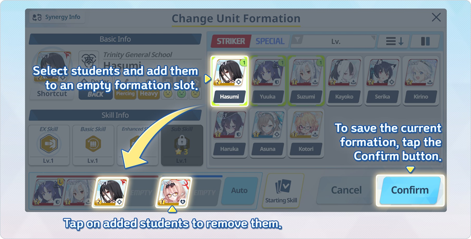

Roster cards, selected slots, Cancel/Confirm. 940 × 478 px. [Original file](https://dszw1qtcnsa5e.cloudfront.net/community/20250123/d015c4b9-a431-40e5-adf0-84d23dca41e9/image202501231602294.png); source S02.

## E07 — Furniture inventory and interaction badge

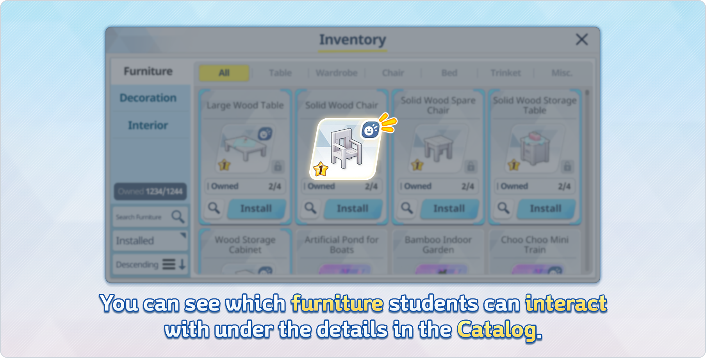

Modal category/filter rails, install cards, smile badge. 1808 × 920 px. [Original file](https://dszw1qtcnsa5e.cloudfront.net/community/20260915/44867d4c-8e70-47f2-89fd-4cd1d851384f/InformatiofCafe08En.png); source S01.

## E08 — Special video furniture confirmation

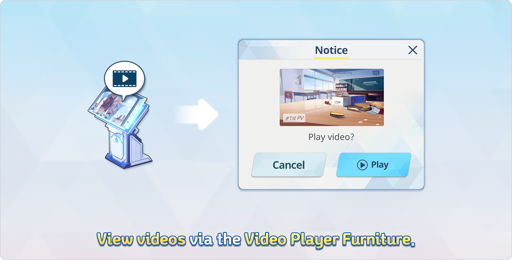

Object and pale confirmation panel. 1808 × 920 px. [Original file](https://dszw1qtcnsa5e.cloudfront.net/community/20260120/911fac3d-1c2f-432e-8840-62dc536e70c0/InformatiofCafe12en.png); source S01.

## E09 — Updated starting-skill action

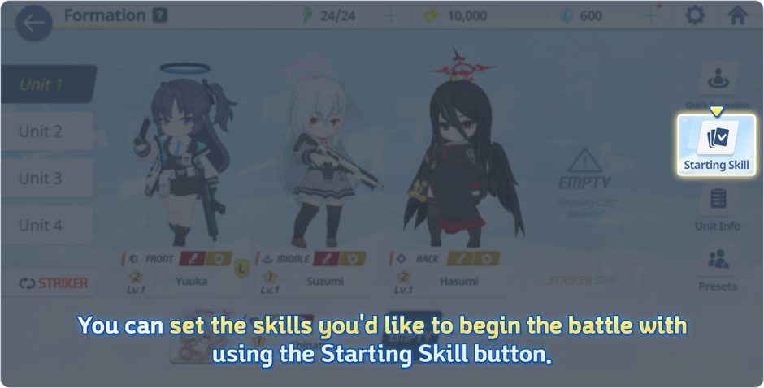

Starting Skill button; dimmed formation screenshot. 940 × 478 px. [Original file](https://dszw1qtcnsa5e.cloudfront.net/community/20260819/786c269f-1015-41e7-9e2a-acab4e3f0572/image.png); source S02.

## E10 — Formation stage composition

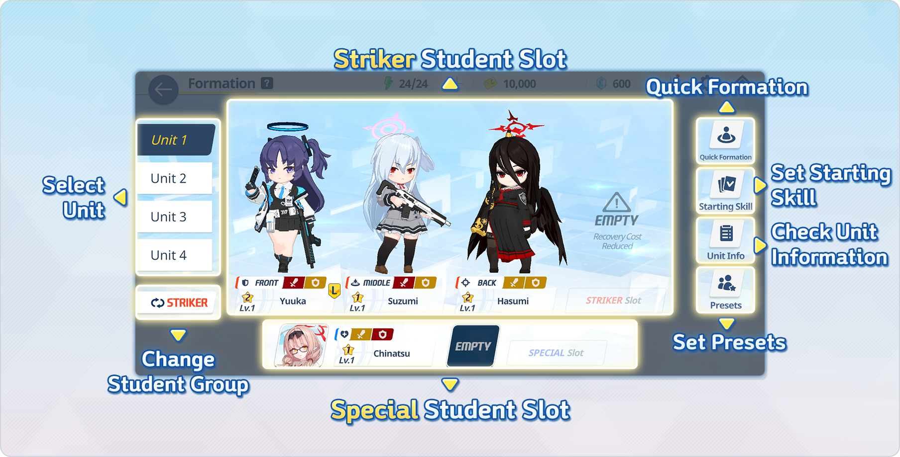

Striker stage, lower Special cards, left tabs and right controls. 1808 × 920 px. [Original file](https://dszw1qtcnsa5e.cloudfront.net/community/20260423/e2df79b0-5b88-43c9-ba23-916147b7475b/InformatiofFormatiof01en.png); source S02.

## E11 — Weapon attack visual crops

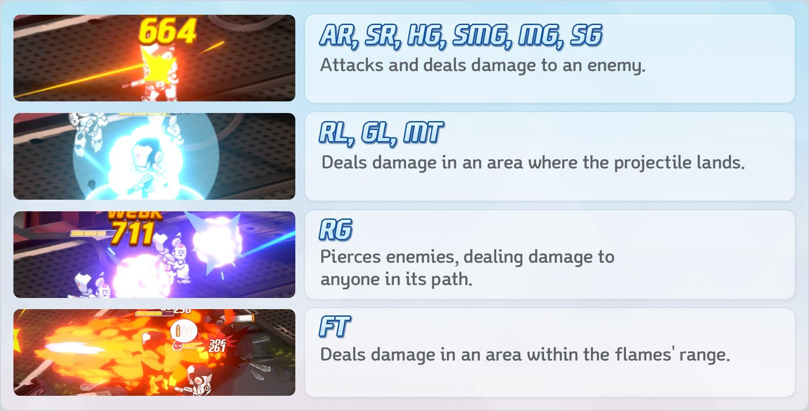

Cropped impacts and damage values; not a full HUD. 1808 × 920 px. [Original file](https://dszw1qtcnsa5e.cloudfront.net/community/20240312/ba5bacde-5a0e-4d27-a739-78dd82c2ada4/image2024031221123591.jpeg); source S03.

## E12 — Student growth and profile

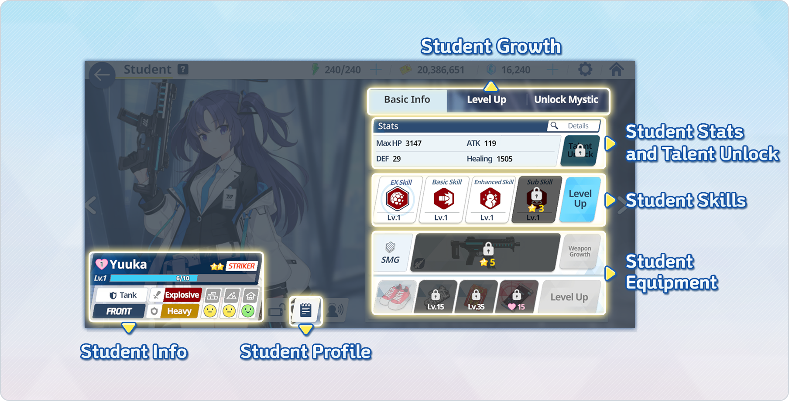

Full-size portrait beside stats, skills, weapon and equipment. 1808 × 920 px. [Original file](https://dszw1qtcnsa5e.cloudfront.net/community/20250131/21b0eb78-09d6-440d-ae6e-2c89b0323c16/InformatiofCharacterDetail05en.png); source S03.

## Coverage gaps

Café states, quick formation, starting skills, weapon impact crops and student profile are covered. Clean current lobby, full combat HUD, loading/error screens, mission selection, story dialogue/MomoTalk, recruitment, audio and all transitions remain uncaptured. The August 2026 update confirms a new lobby, but this package does not substitute an older lobby screenshot for it.
