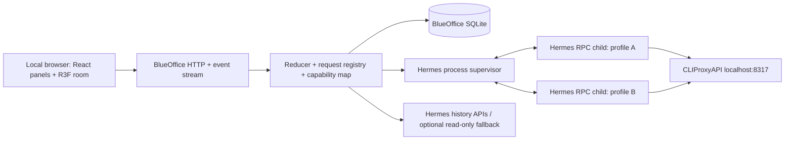

# BlueOffice technical architecture

Status: proposed architecture grounded in source inspection, 2026-10-08. Detailed upstream/local protocol evidence: [Hermes integration research](research/hermes-integration.md). Contracts labeled BlueOffice below are new application contracts, not existing Hermes endpoints.

## Decision

Use a local TypeScript server as process owner and state authority. The browser connects to that server for controls and events. One supervised Hermes stdio JSON-RPC child per configured office agent provides isolation and exact clarification/approval routing. React + R3F renders normalized state; it never connects directly to a model provider or invokes shell commands.

The installed Hermes checkout inspected in this session is `f1247d2e0146bbd8edd4e510b9e67e0d259509a4` (2026-09-24), while upstream was `cfb9ae4f86e221ca1763fff256a44317f2cb5dcb` at research start. Compatibility must target the installed source and probe capabilities rather than assume latest documentation matches it. No upgrade is performed by this plan.



## Existing Hermes interfaces and intended use

The source-owned [TUI gateway](https://github.com/NousResearch/hermes-agent/tree/f1247d2e0146bbd8edd4e510b9e67e0d259509a4/tui_gateway) and [client launcher](https://github.com/NousResearch/hermes-agent/blob/f1247d2e0146bbd8edd4e510b9e67e0d259509a4/ui-tui/src/gatewayClient.ts) support a structured alternative to terminal scraping. Relevant methods include session creation/prompt/interruption/history and profile/tool configuration. Server-originated human-input requests retain exact identities and can be replayed while the runtime survives. Verify field-level contracts in the research report before implementing.

| Interface | Appropriate use | Boundary |
|---|---|---|
| TUI JSON-RPC over stdio | Office-owned live chat, pending request replies, event capture, isolated launch. | Internal protocol evolves; lock a compatibility fixture suite. Process-local live session ids are not history ids. |
| TUI JSON-RPC over WebSocket | Optional future connection to a running compatible Hermes endpoint. | Auth/session routing/ownership must be verified independently; not required for v1. |
| Hermes HTTP + SSE | Optional history/run integration and external observations. | Not presumed equivalent to interactive TUI requests. Do not mix two prompt transports for one session. |
| Hermes dashboard REST | Existing config/schema/session administration features; possible advanced config adapter. | Additional service/auth dependency. No assumption of general optimistic concurrency support. |
| ACP | Future editor-facing adapter; supported agent protocol. | Prefer the TUI contract for the specific clarification/replay behavior verified here. |
| Platform-adapter plugin | Native office messaging/service destination in the Hermes gateway, including interactive clarification/approval rendering through the adapter. | Valid alternate chat route; full office lifecycle/config/history/reconnect contract still needs additional administration/transport. See ADR 0001 follow-up evaluation. |
| Hooks/history scanning | Optional external-session observations or missing details. | Hook availability differs by revision. Passive history cannot grant live process control or exact input readiness. |

A standard chat-completions endpoint is not an agent lifecycle API. The office controls Hermes; Hermes continues to own tool execution and its model interaction loop.

The dashboard-plugin option deserves a bounded early check: its native backend/chat/config ownership could save implementation work. The sidecar recommendation buys an independent room/panel shell and explicit per-agent runtime ownership, at the cost of another adapter/server and Python-process overhead. Local browser delivery does not itself require the sidecar. If a plugin can satisfy the same lifecycle, question recovery, and profile-isolation acceptance without rebuilding those systems, prefer that smaller integration and retain the office-domain/asset/scene contracts.

## Module boundaries

| Module | Owns | Public operations |
|---|---|---|
| `hermes-adapter` | Version discovery, RPC parsing, schema validation, source event normalization, configuration capability mapping. | discover, launch handshake, create/resume session, prompt, interrupt, answer exact request, list history, configure supported keys. |
| `runtime-supervisor` | Child processes, environment, lifetime, runtime epoch, stderr diagnostics, shutdown. | start, drain/stop, status, ownership verification. |
| `office-domain` | Persistent agent/session/desk identities, reduced status, requests, command outcomes. | commands and state snapshots; no engine objects or raw paths exposed to UI. |
| `office-store` | Layout/config revisions, event journal, deduplication, association tables. | transactions, compare revisions, snapshot/replay. |
| `asset-registry` | Manifest validation, paths/hashes, provenance, compatibility, import diagnostics. | catalog, resolve trusted asset, validate pack. |
| `scene-runtime` | Camera, path/occupancy, rig mixers, furniture anchors, projected bubbles. | consume semantic state and layout; emit selection/edit intent. |
| `panels` | Chat, requests, office overview, activity, forms. | Same domain commands as scene UI. |

Keep rendering dependencies out of integration code. A headless reducer/adapter fixture must work without WebGL; the room must work against a deterministic fixture without model access.

## Process launch and ownership

Launch the runtime interpreter belonging to the trusted installed Hermes environment with arguments `-m tui_gateway.entry`, matching the inspected TUI launcher pattern. Set working directory/module lookup deliberately so imports resolve from the trusted Hermes checkout, not an arbitrary project directory. Pass profile-specific Hermes home/environment through the supervisor; set task workspace through the verified session contract. Do not invent `hermes --mode rpc`.

Before launch, discover the executable, repository revision, profile home, required stdio protocol, available methods, and model/API-family configuration. Read only necessary metadata; never return secret environment variables to the browser. Build an allowlisted argument vector using process spawning without a shell. Client input selects validated IDs, not arbitrary executable paths or script bodies.

One office agent has one owned runtime generation. A restarted runtime gets a new epoch even if its OS PID happens to be reused. Canonical profile homes are unique among managed agents; an office-side ownership lease prevents duplicate launches. Before adopting a profile, check for another owner and refuse conflicting live control. This lease does not lock unrelated Hermes applications, so dedicated office profiles are the default. A profile/home may have several historical sessions, but v1 permits one foreground run per office agent. Reject a competing foreground start or explicitly interrupt the existing turn; do not silently switch it.

The supervisor owns only processes it launched and their verified process groups. It does not stop the user's ordinary Hermes gateway or proxy service. Browser close leaves agent execution intact. For v1, server shutdown drains/interrupts owned sessions and stops its children with bounded grace; after a server crash, reconciliation marks orphaned runtimes unknown and requires ownership verification before cleanup. Automatic task resubmission is prohibited.

### Stop semantics

1. **Interrupt task:** call the verified `session.interrupt`; wait for state reconciliation. The configured assistant remains ready afterward.
2. **Stop agent:** mark stopping; stop accepting prompts; persist associations and request disposition; interrupt/drain owned foreground work; send termination to the owned runtime; wait for confirmed exit.
3. If the child fails to exit within a measured grace period, offer Force stop for that owned child/group, with visible implications. Record interrupted/unknown session outcome separately from successful completion.
4. Hermes `process.stop` is a background tool-process control, not backend termination. Do not map it to Stop agent.

## Identity and storage model

| Record | Essential fields |
|---|---|
| `OfficeAgent` | office-generated immutable id, name, profile reference, workspace reference, avatar asset/version, workstation id, desired model/API family, configuration revision. |
| `Runtime` | agent id, runtime epoch, owned child reference, Hermes revision, capabilities, lifecycle, last transport health. |
| `SessionBinding` | office session id, agent/profile/home reference, live Hermes session id if present, stored Hermes session id if present, source, foreground flag, parent linkage if known. |
| `PendingRequest` | office request id, runtime epoch, live/stored session association, original RPC request id/type, allowed responses, public payload, status, expiry metadata if supplied. |
| `OfficeLayout` | id/version/revision, room grid, camera preset, placements, workstation assignments. |
| `Asset` | id/version/hash, runtime model/thumbnail paths, footprint/anchors, clips, provenance and distribution fields. |
| `CommandReceipt` | command id, target, idempotency key, accepted/rejected/unknown outcome, result/error. |

Store BlueOffice data separately from Hermes-owned history. Use SQLite transactions for mappings, command receipts, event order, and layout/config revisions. Do not alter Hermes schemas or write its database directly. Prefer Hermes history methods; a read-only fallback is versioned and optional, and must respect WAL/concurrent-write semantics.

Do not copy a full chat/secret store unnecessarily: keep correlation and normalized event metadata; use Hermes transcripts for durable conversation content where possible. A cached public transcript should have explicit retention/export behavior. A stored session row can be persisted lazily even when creation has already returned its stored id; missing history must not invalidate the live binding.

## Event contract and state reduction

Proposed BlueOffice envelope, independent of upstream message shape:

```json
{
  "schemaVersion": 1,
  "eventId": "office-generated-id",
  "sequence": 123,
  "agentId": "agent-stable-id",
  "runtimeEpoch": "launch-generation-id",
  "sessionId": "office-session-id",
  "runId": "office-run-id-or-null",
  "kind": "request.opened",
  "occurredAt": "2026-10-08T04:00:00Z",
  "receivedAt": "2026-10-08T04:00:00.020Z",
  "evidence": "hermes-rpc",
  "payload": {"requestId": "office-request-id", "requestType": "clarification"}
}
```

Normalized kinds include runtime lifecycle, session binding changes, turn accepted/started/completed/failed/interrupted, public message deltas, tool started/result, request opened/resolved/expired, transport freshness, usage updates, and config/layout updates. The adapter maps only evidenced kinds; it does not fabricate “thinking” from the absence of tools. Preserve raw frame references only in a redacted bounded diagnostic buffer.

The reducer maintains lifecycle, work phase, pending requests, and freshness separately. A pending question or permission marker has presentation priority over ordinary work pose. A disconnect adds an unknown overlay; it does not discard a previously known pending request or produce completion. The latest successful turn can coexist with a new active turn, so completion reactions have a turn identity and play once.

Sequence numbers are assigned by the local server and persisted; upstream timestamps alone do not establish ordering. Deduplicate by runtime epoch and upstream identifiers where available. Output chunks have message/chunk identities so replay cannot duplicate the transcript. Coalesce streaming text for UI updates, but never drop request/error/lifecycle edges for performance.

## Commands and pending-request correctness

The browser uses BlueOffice commands for creating/configuring an agent, start, prompt, interrupt, stop, resume, exact request reply, and layout edits. These proposed endpoints use office IDs and capabilities, never arbitrary Hermes RPC method names from browser input.

A request reply checks agent id, runtime epoch, session binding, exact request identity, current openness, response schema, and command idempotency. The adapter retains the upstream JSON-RPC request id without coercing its type. Clarification batch questions preserve their per-question locks and progress when supported. Approval is a separate schema/control; secret/sudo/vault requests are distinct sensitive forms or an explicit unsupported/handoff path, never coerced into a question bubble response.

Local “accepted” means the office accepted a command for delivery, not that Hermes applied it. Display sent/pending-confirmation until upstream outcome or reconciled request closure. A crash between delivery and journal acknowledgement produces an unknown outcome: reconcile; do not blindly resend a non-idempotent prompt. A second tab replying to a closed request receives a stale result and the current state.

## Reconnection and replay

Browser reconnection obtains a consistent snapshot with a server sequence high-water mark, then resumes later events. If replay retention is exceeded, obtain a new snapshot. Pending requests are part of that snapshot, not ephemeral toast messages.

When Hermes transport reconnect is supported, reconcile with `session.events.since` and the documented `open_requests`; clear only requests proven resolved/expired. An office server surviving browser refresh retains its stdio child, so the browser never needs raw RPC ownership. If the Hermes child dies, invalidate its epoch and requests; old ids cannot be answered into a replacement process. History can be resumed in a new runtime, but that does not prove an old waiting tool continued.

Choose HTTP for mutations plus SSE for ordered server events initially, with a WebSocket transport optional. All connections are same-origin; browser event replay is a BlueOffice responsibility even though upstream also offers replay facilities.

## Configuration management and CLIProxyAPI

Use Hermes-owned configuration interfaces first: `profiles.configure` for supported profile fields, `tools.configure` for supported tool changes, and `config.set` only for its documented limited keys. Check partial application flags and read back the resulting profile. `ui_meta` can optionally hold a namespaced avatar mapping where per-key revisions exist, but the office database remains the primary assignment store.

Advanced settings may use a versioned adapter to dashboard REST or Hermes' own config helper. Avoid a second dashboard service dependency for ordinary v1 setup. Office-managed config mutations run under an office lock with before/after hashes and revision checks. Hermes' general config route is not assumed to supply CAS. Detected external edits cause a conflict/reload; preserve unknown YAML keys. An office lock cannot guarantee atomic exclusion of a noncooperating external writer: dedicated managed profiles and a single-writer policy are required, and adoption must disclose this limitation. For critical changes, stop/reconfigure/restart the owned runtime at a safe boundary.

User-provided routing requirements are authoritative:

| Setting | Required handling |
|---|---|
| Proxy base | `http://127.0.0.1:8317/v1`, service `cli-proxy-api`. |
| Proxy config | `~/.cli-proxy-api/config.yaml`; never rewrite it as part of office config. |
| API key | `~/.cli-proxy-api/.api-key`; backend resolves/injects via the supported Hermes config path, without client exposure or logging. |
| `glm-5.3-flash` | OpenCode Zen Go; Chat Completions. |
| `muse-spark-1.3-contributor` | OpenCode Zen Go; Responses API only. |
| Intentional flags | Preserve `disable-cooling` and `disable-image-generation`. |
| GPT quota | `usage_limit_reached` means a real ChatGPT Plus quota; no automatic bypass/retry storm. |

Exact Hermes setting names and per-profile API-family application are a compatibility spike. Selecting a model name alone is not proof of the correct API route. Model calls were not executed in this research session.

## Local application boundary

Serve browser/UI/API on loopback, validate Host and Origin, and authenticate mutations/event access using a local session established by the launch flow. Use same-origin cookie/token protection and CSRF checks as applicable; do not put bearer credentials in shareable query strings. These are necessary because full management grants process/config access, even on localhost.

Render agent/tool text as untrusted content with sanitized Markdown. Asset imports enforce relative paths, maximum sizes, GLB validation, archive path constraints if archives are later supported, and local resource references. Serve only registry-resolved assets, not arbitrary filesystem paths. Local server requests to user-selected provider endpoints are validated; v1 only needs the explicit loopback proxy.

## Renderer operation

Scene updates consume semantic agent state and layout. Mixers, paths, and camera transitions run imperatively per frame; transcript tokens do not rebuild geometry. Shared model geometry/textures are reference-counted; rig instances remain independent. Start with simple ground contact shadows, stylized materials, and a limited outline pass; add expensive effects only after measurement.

Default orthographic camera has pan/zoom and a reset preset. Layout transforms use a Y-up world with X/Z floor coordinates and integer grid occupancy. Workstation animations use local anchors and manifest compatibility. Missing clips/assets keep the status label/bubble functioning through a fallback; they never change agent state.

## Proposed project shape

```text
apps/web/                  React panels and office scene
apps/server/               local API and supervisor
packages/contracts/        office schemas and command/event types
packages/office-domain/    reducer, identities, capability policy
packages/hermes-adapter/   versioned RPC/history/config integration
packages/scene-runtime/    paths, anchors, animation mapping
assets/manifests/          permitted catalogs and provenance
docs/                      current specifications and research
```

This is a suggested organization, not a scaffolding task. Use the fewest packages that preserve these boundaries; no distributed services are necessary.
