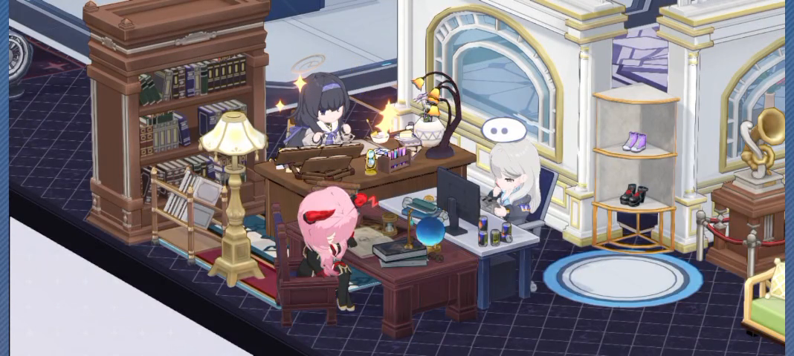
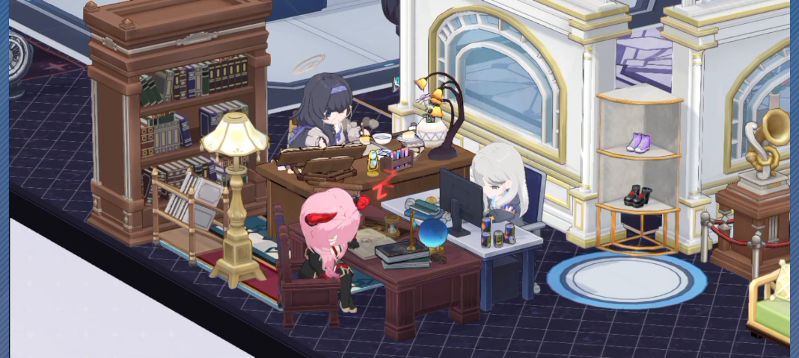
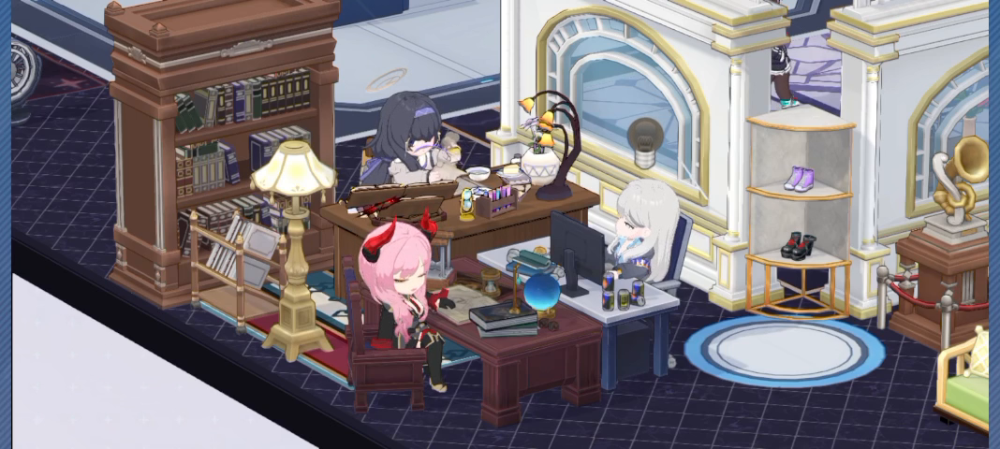

# Modern open office: visual contract

## Selected direction

**U01 — user requirement:** modern, open office with desks and computers, plus an actual café bar. Keep default 2.5D camera, Blue Archive avatars, status bubbles/motions, side chat, Office overview, and Activity overview. RPC remains selected.

**U02 — user interpretation:** the earlier ornate library/study screenshot suits an independent office for a main secretary agent. Retain it as a possible private-office reference, not the shared office's main style. No automated secretary routing or task delegation requirement follows from this preference.

**U03 — user sequencing:** a small classroom-like alternate world may come later. Do not design or implement it before office mode is good enough. The attached screenshot is a future-world reference.

## Evidence observations

**V01:** supplied 8.248504-second recording, 1068×480, H.264 at nominal 30000/1001 frames/s. Metadata measured with ffprobe. Three frames extracted with ffmpeg at requested seek times 0.5, 3.5, and 6.5 seconds, at native resolution without cropping/recoloring. Source frame times may differ by decoder rounding; timestamps are approximate, not motion timing measurements.

Observed: three seated chibi characters, separate desk/chair assemblies, a monitor at the right-hand workstation, books and small desk props, a mixture of modern and ornate furniture, visible faces and halos. This close-up supplies scale/occlusion and workstation interaction references; it does not show the full open office or a café bar.

Observed across samples: the pink-haired character's head direction/pose changes; the rear character's pose changes; an ellipsis-shaped bubble near the right-hand character in the early sample is replaced by a lightbulb-shaped symbol in the later sample. Napping-like red symbols appear near the pink-haired character in early samples. These are game presentation observations, not Hermes state semantics. Exact clip names, loop/transition duration, meanings, and input synchronization are unknown.

**I01:** attached classroom screenshot. Observed: spaced school desks, seated chibi characters, parquet floor, broad open space, blue/white walls, and classroom props. Its role is a later classroom reference only.

## Destination composition — proposed

1. **Shared work area:** multiple modern desk/computer/chair assemblies or low bench-style clusters, clear aisles, open sightlines, visible faces. Each agent owns a workstation/avatar identity; seating is not a lifecycle trigger.
2. **Café bar:** a real counter along one rear/side wall, coffee machine and cups/display, with stools or café seating. Visible from the default camera. This is furniture and optional idle staging; no extra barista agent or game economy is required.
3. **Break area:** optional compact café tables or sofa, subordinate to the workstations and bar.
4. **Secretary office:** optional later private area/preset using the earlier study reference. Its ornate shelves/enclosed partitions should not determine the shared office style.
5. **Classroom world:** deferred; no v1 world selector, classroom asset backlog, or alternate gameplay design.

Prefer simple desk tops, slim supports, coherent computers/chairs, pale neutral surfaces, modest cyan accents, plants, and soft ground shadows. Keep tall barriers out of central sightlines. Modern materials are a destination choice; V01 includes ornate shelves/arches/dark wood that should not be copied wholesale.

The camera remains the planned elevated diagonal orthographic default with pan/zoom/reset and chat-aware framing. Exact source projection, azimuth/elevation, grid dimensions, and meter scale are unmeasured. Calibrate against a real asset slice.

## Motion and information hierarchy — proposed

V01 establishes the desired quality of avatars visibly inhabiting furniture. Final work should look seated and engaged at computers once poses/clips pass validation. Standing idle may be a temporary engineering fallback; it does not establish final seated fidelity.

Map motion to verified Hermes events: work pose during active work, restrained look-up/reaction plus persistent question marker for actual input, brief completion reaction, then idle. The precise question and response live in side chat. Do not map the video's lightbulb to completion or ellipsis to model thinking without an office event contract. Decorative sleep symbols never hide pending requests.

Home keeps the scene dominant and side chat readable. Office/Activity show agents/furniture and sessions without breaking selection. This capture does not change the RPC boundary or process/profile ownership.
